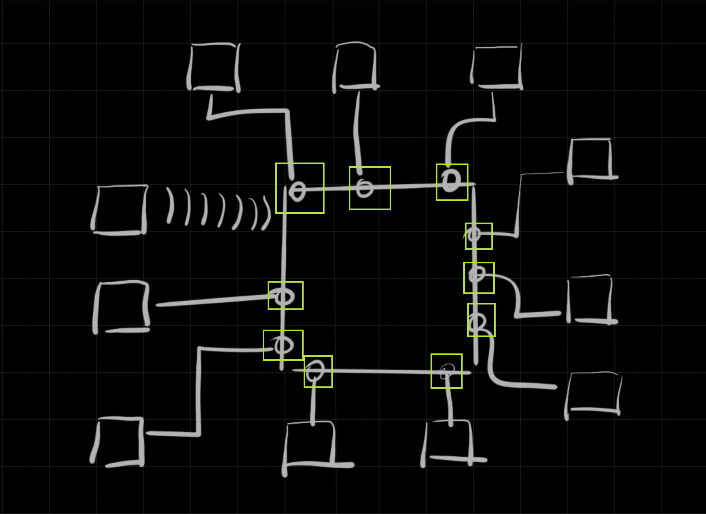

---
---

Referring to the image below from the lesson what is the highlighted part in green square

1.	Computer with NIC
2.	Ethernet port of Router
3.	Ethernet port of NIC
4.	Ethernet cable

Answer 1.	Computer with NIC

Reason for answer.
1.	Computer with NIC is what is represented in green.

---
---

2.	Referring to the image below from the lesson what is the highlighted part in green square

1.	Router
2.	Ethernet port of Router
3.	Computers connected to subnet with NIC
4.	Ethernet cable

Answer 2 Ethernet port of Router

Reason for answer.
Ethernet port of Router is what is represented in green square.

---
---

3.	Referring to the image below from the lesson what is the highlighted part in green square

1.	Router
2.	Ethernet port of Router
3.	Computers connected to subnet with NIC
4.	Ethernet cable

Answer 4 Ethernet cable

Reason for answer.
Ethernet cable is what is represented in green square.

---
---

4.	Referring to the image below from the lesson what is the highlighted part in green square

1.	Router
2.	Ethernet port of Router
3.	Computers connected to subnet with NIC
4.	Ethernet cable

Answer 1 Router

Reason for answer.
Router is what is represented in green square.

---
---

5.	Referring to the image below from the lesson what is the highlighted part in green square

1.	Router
2.	Ethernet port of Router
3.	Computers connected to subnet with NIC
4.	Wifi Connection

Answer 3 Wifi Connection

Reason for answer.
Wifi Connection is what is represented in green square.

